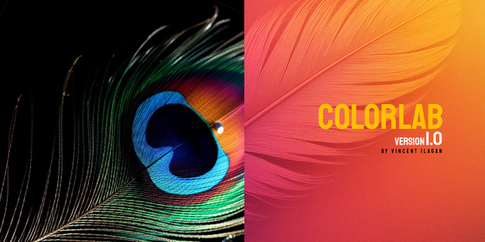

  

# ColorLab - Cinematic LAB LUT Generator

Hi! I’m Vincent Ilagan, a filmmaker and the creator of **ColorLab**.

I made this tool specifically for my personal film projects, especially for color grading.  
With my film deadline coming up soon, I quickly built this to speed up my workflow in applying cinematic color grading using LAB color space and LUTs.

---

## Why I created this

- Easily apply custom cinematic color grading across different computers, especially when I’m away from my main setup.
- Help other filmmakers and artists who want a simple tool to generate LUTs and preview color grading effects before saving.
- Save time and speed up the color grading process.

---

## How to use

1. Select your **Target Image** (the look or color grade you want to match).
2. Select your **Source Image** (the original footage or photo you want to recolor).
3. Choose the **Output Folder** where the `.cube` LUT file will be saved.
4. Click **Generate LUT & Preview** to instantly see the effect applied to your source image.
5. Once satisfied, click **Save LUT** to export the `.cube` file.
6. Import the `.cube` LUT into After Effects, Premiere Pro, DaVinci Resolve, or any editor that supports LUTs.

---

## Notes

- This tool was built quickly but is open to anyone who wants to improve or contribute.
- I hope this helps you in your creative projects and filmmaking.
- Feel free to send feedback or pull requests if you want to enhance it!

---

## License

Licensed under the MIT License.  
You may use and modify this tool for personal or commercial projects as long as the copyright and license notices are included.

---

Thank you for using ColorLab!  
Here’s to making our films and creative works look even better!

— Vincent Ilagan  
FILM MAKER /

